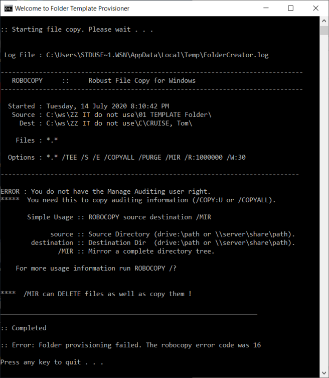

# Folder Template Provisioner

This Windows batch script provisions (copies) new folders with exact permissions and content from a specified existing folder (template) based on the information inputted by a user via its command-line interface. It hopes to reduce the burden of Windows admins by handling over the task of folder provisioning to users.

It uses `robocopy /MIR /COPYALL /ZB` (built-in) to solve the problem where folders copied using Windows Explorer (a.k.a. File Explorer) may not retain unique permissions and inherit permissions from parent folder.

## What's New

- Support of network-shared folder in UNC form (`\\...`)
- Partial support of non-admin users, made possible with `runas /savecred`

## Features

- Accept input from user
  - First name and last name (feel free to modify them for other use cases where appropriate) 
- Copy a new folder using specified template folder retaining exact permissions and content using `robocopy /MIR /COPYALL` named in `LASTNAME, First Name` format according to user input
- Support of network-shared folder in UNC form (`\\...`) is available
  - In other words, for drives mapped using a drive letters, they are supported by specifying the UNC path within this script. See [How to Set up the Scripts](#user-content-step-by-step---how-to-provision-a-new-folder) section below
  - To test or use this script for non-network cases (local drives) from v1.2 and on, specify `\\127.0.0.1\...` or `\\localhost\...` where required
- Support of admin users with UAC enabled
  - Automatically elevate the script to run it as admin if UAC (User Account Control) is enabled but admin rights are unavailable. This requires an optional script in the same folder (`_elevate.vbs`)
- Partial support of non-admin users using `runas /savecred` (built-in)
  - If users do not have admin rights, `_runasAdmin.bat` (included optional script) can be edited to leverage `runas /savecred` to run `FolderTemplateProvisioner.bat` (main script) as admin without entering admin credentials
  - Also refer to [Security Notes](#user-content-security-note) on the risk involved naturally with `runas /savecred`
- Error checking and messages available
  - Windows Script Host is unavailable (for the UAC elevation VBScript)
  - Admin rights are unavailable
  - Invalid first name / last name
  - File copy (folder template provisioning) failure and the `robocopy` return code
- Confirmation prompt
  - Names inputted by user are shown again for review and confirmation, requesting user to confirm there is no existing files
- Logging
  - A `robocopy` log file is saved and appended to `%Temp%\FolderCreator.log`. As this is not meant to be permanent, it can get deleted by system shortly afterwards

## Requirements

1. Windows OS with `robocopy`
2. admin rights (with or without UAC)
3. Non-admin rights (partially supported with an optional setup on `_runasAdmin.bat`)

## Script Filenames

1. `FolderTemplateProvisioner.bat` (main script)
2. `_elevate.vbs` (optional, for admin users with UAC turned on, trigger UAC elevation prompt)
3. `_runasAdmin.bat` (optional, for non-admin users to leverage `runas /savecred` to run as admin)

## Folder Hierarchy

```c
│ FolderTemplateProvisioner.bat // main script
│ _elevate.vbs // For admin users with UAC enabled to auto-trigger UAC prompt (optional)
│ _runasAdmin.bat // For non-admins to run as admin without admin credentials (optional)
│
├───ZZ IT_do not use\01 Template Folder // Template folder (this can be a sub-folder)
│                                       // with folders/files of set permissions to copy
│
├───A // Last names beginning with an "A"
│   │───LASTNAME, Firstname 1
│   │───LASTNAME, Firstname 2
│   │                       .  // Each copied folder is named in this way according
│   │                       .  // to names inputted by user with sub-folders and files
│   │                       .  // retaining specific permissions
│   └───LASTNAME, Firstname n
│
├───B
├───C
│   .
│   .   // Created folders are placed in folders according to initials from user input
│   .
└───Z
```

## Step by Step - How to Set up the Scripts

**Step 1**. Skip this step and go straight to step 2 if users have admin rights. This is for cases where users executing the script do not have admin rights.

Edit the UNC path in `_runasAdmin.bat` setting it to the the script path, e.g. `\\serverName\d$\Human Resources\01_Personnel-Files\FolderTemplateProvisioner.bat`

- It must be a UNC path starting with "\\" instead of a drive letter

Edit `/u:DOMAIN\username` by changing `DOMAIN` to the Active Directory domain name (NETBIOS name), and the `username` as the admin user. For non-domain (workgroup) scenarios, `DOMAIN` can be skipped by removing `DOMAIN\`

- If a non-domain account is specified, `runas` command still requires the PC to be connected to domain. This appears to be a limitation of `runas`

- User Account Control (UAC) has to be disabled, i.e. setting `EnableLUA` to `0` under Windows registry `HKEY_LOCAL_MACHINE\SOFTWARE\Microsoft\Windows\CurrentVersion\Policies\System`, or the target runas user is the [built-in domain or local Administrator account](https://docs.microsoft.com/en-us/windows/security/threat-protection/security-policy-settings/user-account-control-admin-approval-mode-for-the-built-in-administrator-account) which is unaffected by UAC.

  - Kindly ensure the [group policy](https://docs.microsoft.com/en-us/windows/security/threat-protection/security-policy-settings/user-account-control-admin-approval-mode-for-the-built-in-administrator-account) `User Account Control: Use Admin Approval Mode for the built-in Administrator account` is `undefined` or `disabled`; otherwise, it may prevent the built-in administrator account from bypassing UAC limitations (in case this approach is chosen instead of disabling UAC)

Before `_runasAdmin.bat` (or the `runas /savecred ...` command) can be run by non-admin users, it needs to be **run once on PCs of users who need to use Folder Template Provisioner** without admin credentials. (The first run involves prompting for admin credentials where an admin needs to be there to input admin password once)

**Step 2**. Edit `encPath` variable at the upper area of `FolderTemplateProvisioner.bat` script by setting it to the network folder containing the script, e.g. `\\serverName\d$\Human Resources\01_Personnel-Files`

**Step 3**. Edit `templateName` variable at the upper area of `FolderTemplateProvisioner.bat` script by setting it to the folder acting as the template, e.g. `ZZ IT_do not use\01 Template Folder`, with required files and permissions inside

**Step 4**. Place all scripts (`FolderTemplateProvisioner.bat`, optionally `_elevate.vbs` and `_runasAdmin.bat`) inside a folder containing `A,B...Z` sub-folders, sitting aside. The `A-Z` folders contains the template folder and provisioned folders named `LASTNAME, Firstname` copied by the script from the template folder

## Step by Step - How to Provision a New Folder

**Step 1**. Double-click `FolderTemplateProvisioner.bat` and follow on-screen instructions

- For non-admin users, they should run `_runasAdmin.bat` instead

**Step 2**. Input last name and first name

**Step 3**. Review the input

**Step 4**. Wait for `robocopy` file copy (folder template provisioning)

**Step 5**. Verify the created folder

## Screenshots - Provisioning a New Folder with the Script

A. Run `FolderTemplateProvisioner.bat`


**Note**: non-admins should run `_runasAdmin.bat` instead, available since v1.2

For admins with UAC enabled, a UAC elevation prompt (like the one below) is displayed automatically, provided that an optional `_elevate.vbs` exists in the same folder. (`_elevate.vbs` should not be run directly. Instead, run `FolderTemplateProvisioner.bat`)


B. Input first name and last name


C. Review and confirm input


**Note**: Since v1.2, users would receive a message requesting them to ensure no folder of the same name exists in destination before continuing; otherwise, content would be overwritten.

D. Robocopy provisions new folder from folder template with exact content and permissions


**Note**: Since v1.2, users would receive a message at the end recommending them to verify the created folder at target location.

## Screenshots - Error Messages

A. Name inputted by user is invalid


B. Robocopy error ends with a return code presented to user



C. No admin rights are detected, while UAC is off and/or the optional `_elevate.vbs` is not in the same folder


Other error messages include:

- Windows Script Host is unavailable (for the UAC elevation VBScript)
  
## Security Note

This part can be skipped if you don't let users use this set of scripts without admin rights.

As with most technology that enables convenience, kindly beware of the natural security risk involved with `_runasAdmin.bat`, i.e. `runas /savecred`. In this case, a non-admin user would be able to use the `runas /savecred` command to run any command as an admin without entering a password. Please do understand such risk involved if you still would like to go ahead with the non-admin approach to using this script.

## Another Possible Approach for Non-Admin

This part can be skipped. It is only for enthusiasts wishing to modify this script to run it as non-admin without even using `_runasAdmin.bat` or `runas /savecred`.

- Admins rights or the `_runasAdmin.bat` (`runas /savecred`) workaround for non-admin are already supported by this script. The below may not be suitable to all cases and hence, it is left as an idea for enthusiasts to attempt should it be desired.

Several prerequisites and/or adjustments would be required (**experimental**):

1. Remove `/ZB` parameter from the `robocopy` command in the script (note: `/ZB` uses backup operator rights to copy if permission is unavailable. This requires admin rights)
2. Change `/COPYALL` to `/COPY:DATSO` (this removes the 'manage auditing' part which requires admin rights)
3. The template folder should include the desired non-admin user as **owner** with **full** permission in the underlying folders
4. Remove lines in this script between `attrib >nul 2>&1` and `:skipAdminCheckSubsequent`

**Note**: The above is approach is experimental, hence unsupported.

## Release History

| Ver | Date | Changes |
| --- | --- | --- |
| 1.2 | 20200730 | - Support of network-shared folder in UNC form (`\\...`) is available<br>- Support of non-admin users is provided by `runas /savecred`<br>- Remove support of UNC-unsupported error-checking cases |
| 1.1 | 20200719 | Folder template consolidated as single folder instead of multiple ones within sub-folders |
| 1.0 | 20200714 | [First release](https://github.com/wandersick/ws-folder-template-provisioner/tree/6b0c9aad5375afc5dfa0ef687daeeced399d642b) where template folders are located in each sub-folders |
