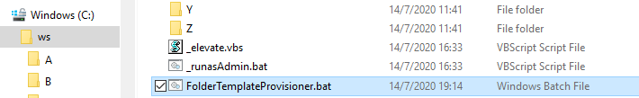
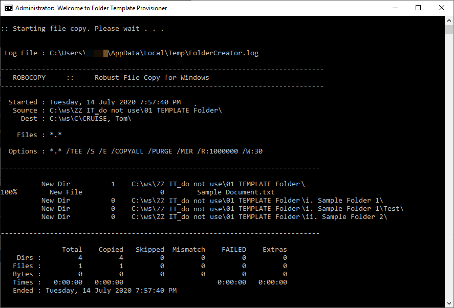

# Folder Template Provisioner

This Windows batch script provisions (copies) new folders with exact permissions and content from a specified existing folder (template) based on the information (first name and last name) inputted by a user via its command-line interface.

It solves a problem using `robocopy /MIR /COPYALL` in which folders copied using Windows Explorer (a.k.a. File Explorer) may not retain unique permissions and inherit permissions from parent folder.

The script has been designed with care to improve usability and avoid accidental deletion.

## Features

- Accept input from user
  - First name and last name
- Copy a new folder using specified template folder retaining exact permissions and content using `robocopy /MIR /COPYALL` named in `LASTNAME, First Name` format according to user input
- Protection
  - Guard against data loss if target folder already exists
    - Target folder is popped up for user to check
    - Confirmation from user is required before continuing
  - Validate source template folder and target folder before running `robocopy`
- Automatic UAC prompt
  - Automatically elevate the script to run it as admin if UAC (User Account Control) is enabled but admin rights are unavailable. This requires an optional script in the same folder (`_elevate.vbs`)
- Error checking and messages available
  - Windows Script Host is unavailable (for the UAC elevation VBScript)
  - Admin rights are unavailable
  - Invalid first name / last name
  - Target `A-Z` folder is invalid or inaccessible
  - Template folder name does not exist in target location or wrongly defined in the script
  - Target folder already exists, requiring user to confirm
  - File copy (folder template provisioning) failure and the `robocopy` return code
- Confirmation prompt
  - Names inputted by user are shown again for review and confirmation
  - A folder with the same name already exists, where confirmation is required from user before continuing, as `robocopy /MIR` (mirror), the command responsible for copying folder templates, would result in loss of data in existing folder
- Pop up target folder automatically for convenience
  - Optionally at the end of successful folder creation
  - Or, when a folder with the same name already exists, where confirmation is required from user before continuing
- Logging
  - A `robocopy` log file is saved and appended to `%Temp%\FolderCreator.log`. As this is not meant to be permanent, it can get deleted by system shortly afterwards

## Requirements

1. Windows OS with `robocopy`
2. Administrator rights (required by `robocopy /COPYALL`, referring to the last screenshot in this README document)

## Script Filenames

1. `FolderTemplateProvisioner.bat` (main script)
2. `_elevate.vbs` (optional, for UAC elevation if admin rights are unavailable, provided that User Account Control is enabled in the system)

## Folder Hierarchy

```c
│ FolderTemplateProvisioner.bat // main script
│ _elevate.vbs // UAC elevation script (optional)
│
├───ZZ IT_do not Use\01 Template Folder // Template folder (this can be a sub-folder)
│                                       // with folders/files of set permissions to copy
│
├───A // Last names beginning with an "A"
│   │───LASTNAME, Firstname 1
│   │───LASTNAME, Firstname 2
│   │                       .  // Each copied folder is named in this way according
│   │                       .  // to names inputted by user with sub-folders and files
│   │                       .  // retaining specific permissions
│   └───LASTNAME, Firstname n
│
├───B
├───C
│   .
│   .   // Created folders are placed in folders according to initials from user input
│   .
└───Z
```

## Steps by Step - How to Set up the Scripts

1. Edit `templateName` variable at the upper area of `FolderTemplateProvisioner.bat` script by setting it to the folder acting as the template, e.g. `ZZ IT_do not Use\01 Template Folder`, with required files and permissions prepared inside
2. Place both scripts (`FolderTemplateProvisioner.bat` and optionally `_elevate.vbs`) inside a folder containing `A,B,C...Z` sub-folders, sitting beside them. The `A-Z` folders contains the template folder and provisioned folders named '`LASTNAME, Firstname`' copied by the script from the template folder

## Step by Step - How to Provision a New Folder

1. Double-click `FolderTemplateProvisioner.bat` and follow on-screen instructions
2. Input last name and first name
3. Review the input
4. Wait for `robocopy` file copy (folder template provisioning)
5. Verify the created folder (which pops up optionally at the end)

## Screenshots - Provisioning a New Folder with the Script

A. Run `FolderTemplateProvisioner.bat`



B. UAC elevation is prompted automatically when admin rights are unavailable, provided that an optional `_elevate.vbs` exists in the same folder


C. Input first name and last name


D. Review and confirm input


E. Robocopy provisions new folder from folder template with exact content and permissions



F. Open folder after completion (optional)


G. Verify created folder via the opened Windows Explorer


## Screenshots - Error Messages

A. Target folder already exists


B. Name inputted by user is invalid


C. Target `A-Z` folder is invalid or inaccessible


D. Source template folder does not exist or is wrongly defined within script


E. No admin rights are detected, while UAC is off and/or the optional `_elevate.vbs` is not in the same folder


F. Robocopy error ends with a return code presented to user


## Release History

| Ver | Date | Changes |
| --- | --- | --- |
| 1.1 | 20200719 | Folder template consolidated as single folder instead of multiple ones within sub-folders |
| 1.0 | 20200714 | [First release](https://github.com/wandersick/ws-folder-template-provisioner/tree/6b0c9aad5375afc5dfa0ef687daeeced399d642b) where template folders are located in each sub-folders |
